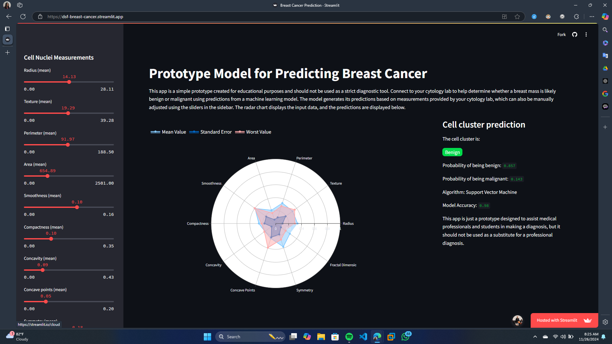

# **Digital Skill Fair 33.0 - Data Science Class**

    &nbsp;&nbsp;
    &nbsp;&nbsp;
    &nbsp;&nbsp;

<figure>
    
    <figcaption align="center"><b>Demo Application</b></figcaption>
</figure>

## **Demo Project**

[Breast Cancer Application](https://dsf-breast-cancer.streamlit.app/)

## **Future Work**

-   [x] Data Acquisition **(Done)**
-   [ ] Exploratory Data Analysis & Visualization
-   [ ] Feature Engineering
-   [x] Modelling **(Done)**
-   [x] Model Evaluation **(Done)**
-   [ ] Hyperparameters Tuning
-   [ ] Trying Other Algorithms - For now, just SVM, RF & MLP.
-   [ ] Model Explainability – Implement SHAP or LIME for better understanding of predictions.
-   [ ] Feature Importance Analysis – Identify key features in the model.
-   [ ] Model Documentation – Provide detailed documentation on the running app, training process and model.

## **Resources**

-   **UCI Machine Learning Repository** : https://archive.ics.uci.edu/dataset/17/breast+cancer+wisconsin+diagnostic
